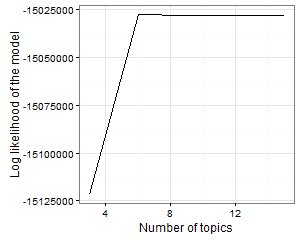

Final Presentation
========================================================
author: Bill Eddins
date: 2016-01-23

This report presents an analysis of internet text files including blogs, news feeds and twitters to for a course in machine learning. See this link for more information [Data Science Specialization](https://www.coursera.org/specialization/jhudatascience/1?utm_source=catalog).  

There are two stated objectives for this project: a shiny app written in R which uses ngrams to guess a word and a presentation of the R apps creted on RPubs.com. The apps might run in any device with internet access. 

Building the Shiny App
========================================================
The Shiny App was built in two phases. The first phases resulted in an R app named `CreateTrigrams.R` that builds a list of trigrams. The second phase resulted in two apps: server.R and app.R. You can access all code at the of the presentation. 

`CreateTrigrams.R` has the most sophisticated code. The reader should make note of `saveSubset`. It will be examined for optimization since it reads/writes text files. Other code preprocesses the text by removing email characters, removing numbers, converting text to lower case, and removing profane words. A special routine, `triGramTokenizer`, is created to control the functioning of the `TermDocumentMatix` statement. Finally, a file named `FreqTerms.csv` is generated to be used by the shiny app.  

Toward a Smarter Shiny App
========================================================
SwiftKey is interested in our apps because they develop internet apps. I propose that shiny app be supplemented with machine learning apps to determine when overarching topics change. `AnalyzeTextTopics.R` monitors number of topics and the log likelyhood (LL), an indication of goodness of fit. Either of these parameters can be easily monitered.  

***

The graph to above shows that the optimal number of topics is 6. LL is -27065909 at 9% sampling rate (not shown in graph).  

Optimizing the Shiny App
========================================================
Several R packages used for profiling were examined to find bottlenecks. `Profile_R_micro.R` uses the `microbenchmark` package. See the image below for timing.

There are two functions named `saveSubset` and `saveSubsetRODBC` which were profilled using `microbenchmark`.  `saveSubset` is written in base R. It took on aveage 45.2 microseconds to execute. `saveSubsetRODBC` uses the RDOBC package and MS SQL Server. It took on average 15.4 micoseconds to execute. Almost 3 times faster!

In Summary
========================================================
R code segments were written to create and analyze internet text. If SwiftKey is interested, an R package can be made to analyze internet text and to optimize operations. Following are links to the code on shiny.io and github. You may need to right click the url and select ...

- `CreateTrigrams.R`  
- The Shiny app  
  - server.R  
  - ui.R  
- `AnalyzeTextTopics.R`  
- `Profile_R_micro.R`  
